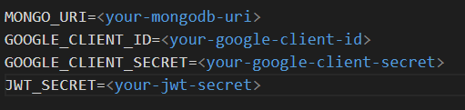

# Project Documentation

## Table of Contents
- [Introduction](#introduction)
- [Project Structure](#project-structure)
- [Installation](#installation)
- [Environment Variables](#environment-variables)
- [Running the Project](#running-the-project)
- [API Endpoints](#api-endpoints)
  - [Authentication](#authentication)
  - [Projects](#projects)
- [Frontend](#frontend)
- [Technologies Used](#technologies-used)
- [License](#license)

## Introduction
This project is a full-stack application that includes a back-end server built with Node.js, Express, and MongoDB, and a front-end client built with React and Vite. The application allows users to manage projects, tasks, and team members.

## Project Structure


## Installation
1. Clone the repository:
    ```sh
    git clone <repository-url>
    cd <repository-directory>
    ```

2. Install dependencies for both the back-end and front-end:
    ```sh
    cd back-end
    npm install
    cd ../front-end
    npm install
    ```

## Environment Variables
Create a [.env](http://_vscodecontentref_/30) file in the [back-end](http://_vscodecontentref_/31) directory with the following content:




## Running the Project
1. Start the back-end server:
    ```sh
    cd back-end
    npm start
    ```

2. Start the front-end development server:
    ```sh
    cd front-end
    npm run dev
    ```

## API Endpoints

### Authentication
- **POST /auth/signup**: Sign up a new user.
- **POST /auth/login**: Log in an existing user.
- **GET /auth/me**: Get the authenticated user's information.
- **POST /auth/logout**: Log out the authenticated user.

### Projects
- **POST /projects**: Create a new project.
- **GET /projects/created/:userId**: Get projects created by the logged-in user.
- **GET /projects/assigned/:userId**: Get projects assigned to the logged-in user.
- **POST /projects/:projectId/team**: Add a team member to a project.
- **GET /projects/:projectId/team**: Get team members of a project.

## Frontend
The front-end is built with React and Vite. The main components include:
- [App.jsx](http://_vscodecontentref_/32): The main application component that sets up routing.
- [navbar.jsx](http://_vscodecontentref_/33): The navigation bar component.
- [herosection.jsx](http://_vscodecontentref_/34): The hero section component.
- [DepartmentsSection.jsx](http://_vscodecontentref_/35): The departments section component.
- [CampaignSection.jsx](http://_vscodecontentref_/36): The campaign section component.
- [Slides.jsx](http://_vscodecontentref_/37): The slides section component.
- [footer.jsx](http://_vscodecontentref_/38): The footer component.
- [login.jsx](http://_vscodecontentref_/39): The login page component.
- [signup.jsx](http://_vscodecontentref_/40): The signup page component.
- [dashboard.jsx](http://_vscodecontentref_/41): The dashboard page component.
- [taskpage.jsx](http://_vscodecontentref_/42): The task page component.
- [calendar.jsx](http://_vscodecontentref_/43): The calendar page component.
- [messages.jsx](http://_vscodecontentref_/44): The messages page component.
- [projects.jsx](http://_vscodecontentref_/45): The projects page component.
- [postloginlayout.jsx](http://_vscodecontentref_/46): The layout component for post-login pages.

## Technologies Used
- **Back-end**:
  - Node.js
  - Express
  - MongoDB
  - Mongoose
  - Passport.js
  - JWT
  - bcryptjs
  - dotenv
  - cors
  - express-session
  - cookie-parser

- **Front-end**:
  - React
  - Vite
  - Tailwind CSS
  - Axios
  - React Router DOM
  - Chart.js
  - React Big Calendar
  - Framer Motion
  - JWT Decode
  - Socket.io-client
  - React Big Calender
  - Date-fns

## License
This project is licensed under the MIT License.

---